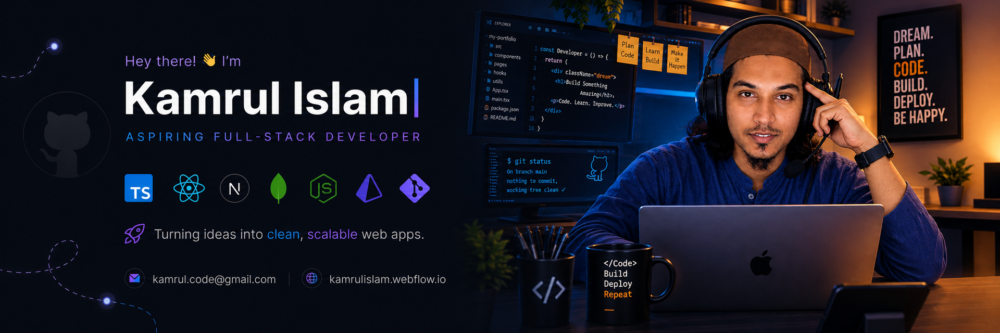

  

 

# 👋 Hi, I'm **Kamrul Islam**

  

  
  &nbsp;
  
  &nbsp;
  

 

## 👨‍💻 About Me

I'm a **Frontend Developer** passionate about building modern, responsive, and user-friendly web applications.

I started with **HTML, CSS, and JavaScript** and am currently focused on **React** while expanding my skills toward **Full-Stack Web Development**.

My goal is to become a developer who can take an idea from **frontend → backend → database → deployment**.

- 🌱 Currently learning **React & TypeScript**
- 🚀 Working toward becoming a **Full-Stack Developer**
- 💻 Building projects to strengthen my frontend and JavaScript skills
- 🧩 Practicing **Data Structures & Algorithms** and problem solving
- 🔧 Interested in **REST APIs, backend development, databases, and authentication**
- 🎨 I enjoy turning UI designs into responsive websites
- 📚 Always learning and improving through projects
- 🤝 Open to collaborating on interesting web projects

 

  

## 🛠️ Tech Stack

  

    
   ### Frontend 
    
  
  

  

### Backend — Learning &emsp;&emsp;&emsp;&emsp;&emsp;&emsp; Database — Learning

 &emsp;&emsp;&emsp;&emsp;&emsp;&emsp;&emsp;&emsp;&emsp;&emsp;&emsp;&emsp;&emsp;

  

   

### Tools & Design

  

 

## 🚀 Currently Learning

  

  My current focus is not just learning technologies individually, but understanding <b>how they work together to build complete applications</b>.

 

## 📊 GitHub Stats

  
  
  
  
  
  

 

## 🤝 Connect With Me

 

   

 
  

---

 

## ⚡ A Little More About Me

I believe the best way to learn development is to **build things**.

I'm currently focused on strengthening my fundamentals, building real-world projects, learning backend development, and gradually moving toward full-stack development.

I don't want to just learn frameworks — I want to understand **how the web works and how to build complete products from scratch**.

 

  

---

### 🚀 Learning → Building → Improving → Repeating

_⭐ Thanks for visiting my profile!_

 

---
