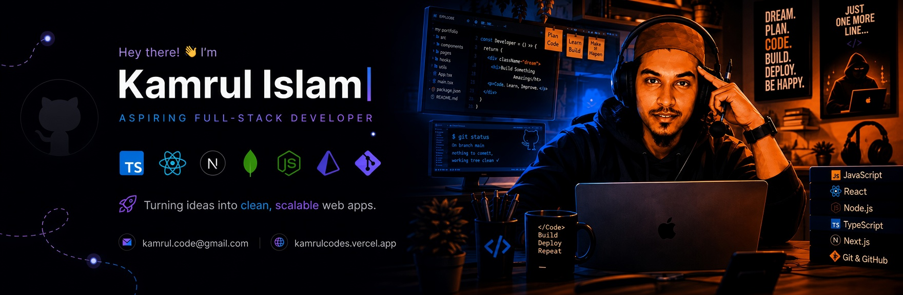
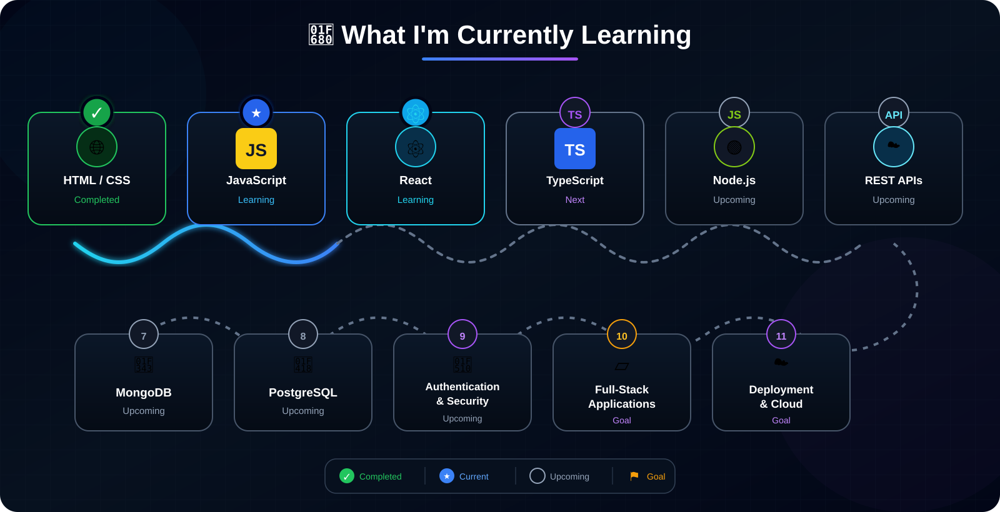

  

# 👋 Hi, I'm Kamrul Islam

 

### 💻 Building for the Web • 🚀 Learning Full Stack • 🧠 Solving Problems

---

## 👨‍💻 About Me

I'm a **Frontend Developer** passionate about building modern, responsive, and user-friendly web applications.

I started with **HTML, CSS, and JavaScript** and am currently focused on **React** while expanding my skills toward **Full-Stack Web Development**.

My goal is to become a developer who can take an idea from **frontend → backend → database → deployment**.

- 🌱 Currently learning **React & TypeScript**
- 🚀 Working toward becoming a **Full-Stack Developer**
- 💻 Building projects to strengthen my frontend and JavaScript skills
- 🧩 Practicing **Data Structures & Algorithms** and problem solving
- 🔧 Interested in **REST APIs, backend development, databases, and authentication**
- 🎨 I enjoy turning UI designs into responsive websites
- 📚 Always learning and improving through projects
- 🤝 Open to collaborating on interesting web projects

---

## 🛠️ Tech Stack

### Frontend

### Backend — Learning

### Database — Learning

### Tools & Design

---

  

My current focus is not just learning technologies individually, but understanding **how they work together to build complete applications**.

---

## 📊 GitHub Stats
<table>
  <tr>
    <td align="center">

    </td>
    <td align="center">
      
    </td>
  </tr>
  <tr>
    <td align="center">
      
    </td>
    <td align="center">
     
    </td>
  </tr>
</table>

---

## 🤝 Connect With Me

<table>
  <tr>
    <td align="center">
      
    </td>
    <td align="center">
      
    </td>
    <td align="center">
      
    </td>
  </tr>
  <tr>
    <td align="center">
      
    </td>
    <td align="center">
      
    </td>
    <td align="center">
    </td>
  </tr>
</table>

---

## ⚡ A Little More About Me

I believe the best way to learn development is to **build things**.

I'm currently focused on strengthening my fundamentals, building real-world projects, learning backend development, and gradually moving toward full-stack development.

I don't want to just learn frameworks — I want to understand **how the web works and how to build complete products from scratch **

---

### 🚀 Learning → Building → Improving → Repeating

⭐ Thanks for visiting my profile!

---
